# Integrating Python with Microsoft Dynamics 365

## Why Python?

- Used by Data Analytics Professionals
- Libraries like Pandas, Numpy, PyPlot, Keras, and PySpark
- Taught to new developers in most CS programs
- Tools like iPython Notebooks to integrate with Jupyter Labs, Google Collab, and Zepl

## Getting Started

### What you will need

- Python (Anaconda)
- A Dynamics 365 Organization

### Registering your Python App with Dynamics 365

- Go to http://portal.azure.com and log in with your Dynamics 365 Account. Select **Azure Active Directory** from the menu.
  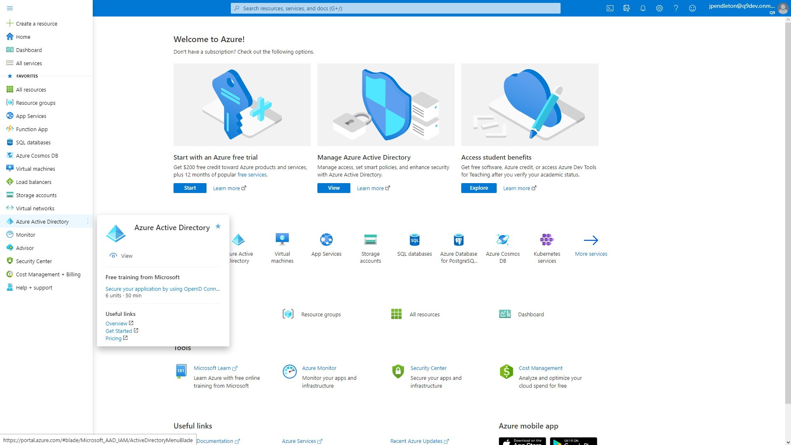

- Select **+ New registration**.
  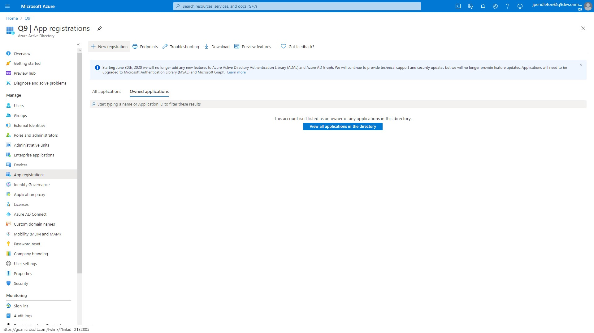

- Enter a name for your python application and select **Register**.
  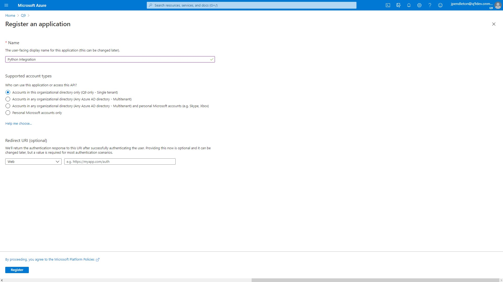

- Select **API Permissions** in your new app registration and select **+ Add a permission**. Select **Dynamics CRM** from the list.
  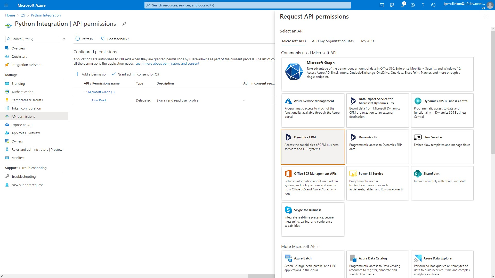

  > :information_source: **Note** Multiple API permissions point to https://admin.services.crm.dynamics.com/, such as Dynamics CRM and Common Data Service (soon to be Dataverse). Selecting any of these will work.

- Ensure **Delegated Permissions** is selected, **user_impersonation** is checked, and click **Add permissions**.
  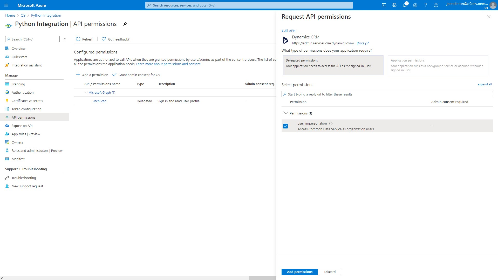

- Select **Manifest** and ensure that `"allowPublicClient"` is set to `true`.
  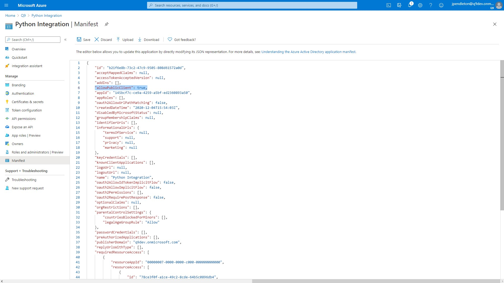

- Select **Certificates and secrets** and select **+ New client secret** followed by the expiration and **Add**.
  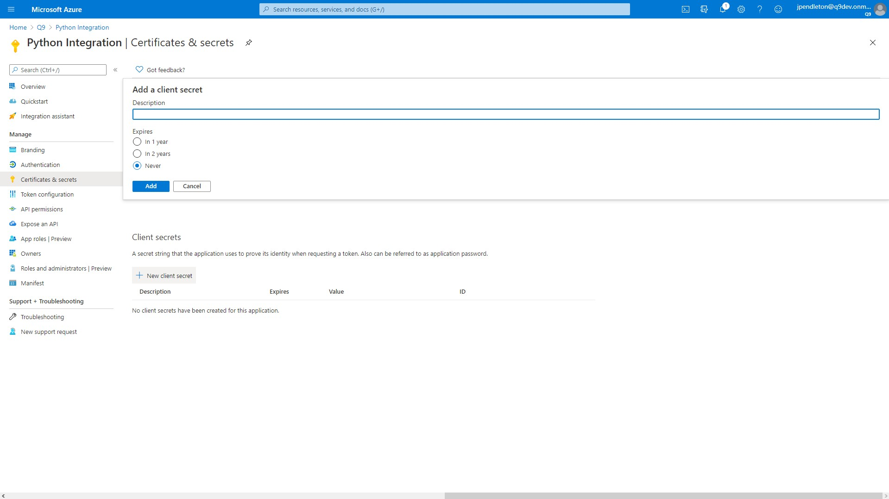

- And that's it. All the information your Python needs to connect to your organization is on the **Overview** tab.
  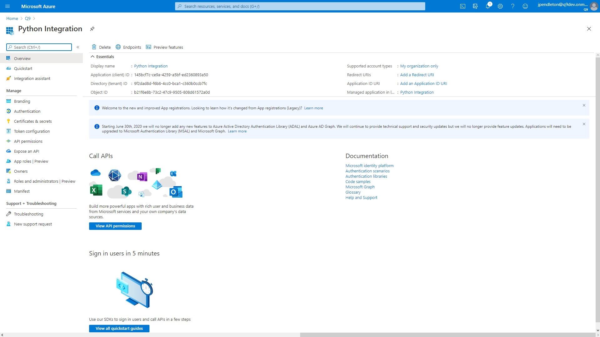

### Creating An Application User

- Navigate to Security in your Dynamics Organization and select **Users**.
  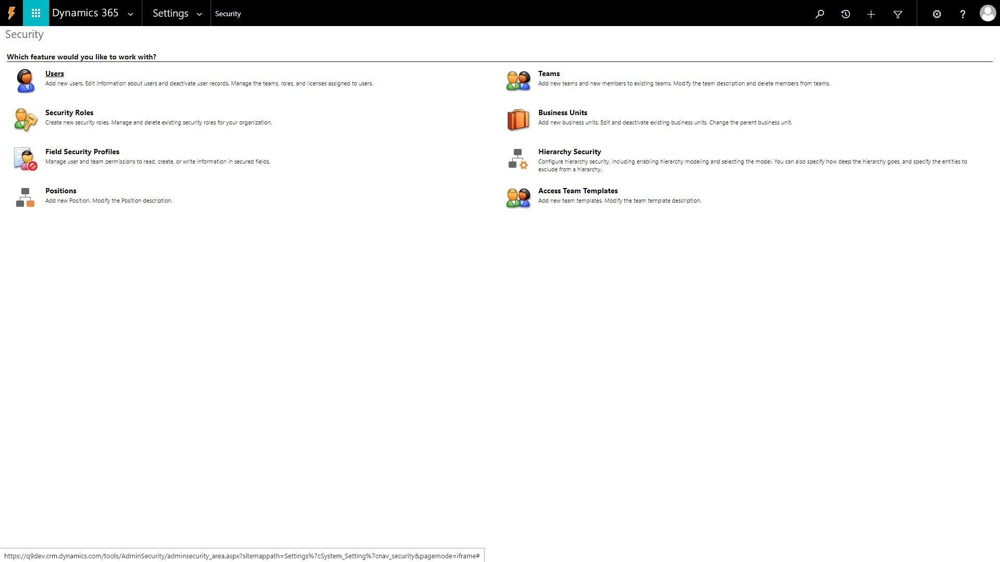

- Select the Application Users View and select **+ NEW**.
  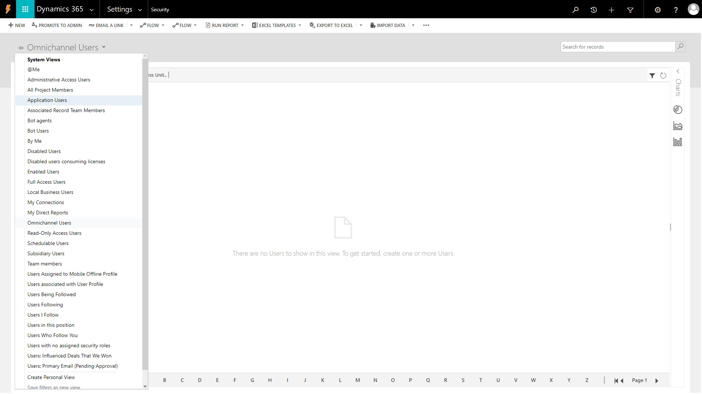

- Select the Application User Form and enter the required fields.
  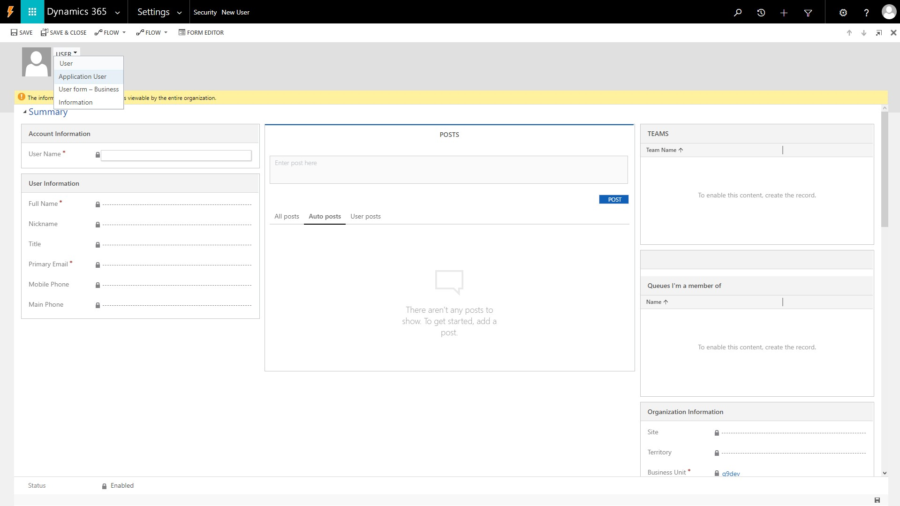

- The Application ID should match the Application ID from your App Registration in the Azure Portal.
  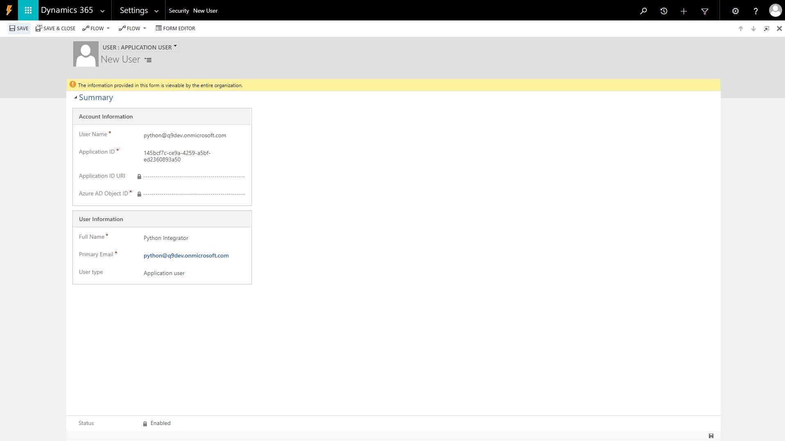

- Assign the new user a security role. You can just copy the System Administrator role
  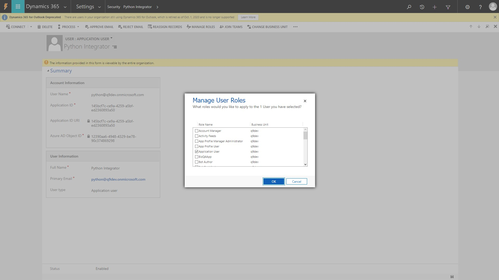

## Using Python

- Create a python file with the following components:

        ApplicationID = '145bcf7c-ce9a-4259-a5bf-ed2360893a50'
        DirectoryID = '9f2dad8d-f6b8-4cc0-bca1-c360b0ccb7fc'
        ObjectID = 'b21f6e8b-73c2-47c9-9505-808d61572a0d'

  These are the values from our App Registration Overview in the Azure Portal.

        import requests
        import json

  The libraries we will use to Authenticate and query data from Dynamics.

  > :bulb: **Tip** If Python does not recognize these libraries you can run `pip install <library name>` in your terminal to install them.

        crmorg = 'https://q9dev.crm.dynamics.com'
        clientid = ApplicationID
        tenantid = DirectoryID
        oauth2endpoint = f'https://login.microsoftonline.com/{tenantid}/oauth2/token'

  These are the values we will use to authenticate with Dynamics.

        tokenpost = {
            'client_id': clientid,
            'resource': crmorg,
            'client_secret': 'ZTsoSoK~_19Af-NSNngdzrGPFa~6Ns8Ayl',
            'grant_type': 'client_credentials'
        }

        response = requests.post(oauth2endpoint, data=tokenpost)

        data = response.json()

        token = ''
        try:
            token = data['access_token']
            print('Access token retrieved')
        except KeyError:
            print('Could not get access token')

  This will give us our token to use the Dynamics WebApi.

        headers = {
            'Authorization': 'Bearer ' + token,
            'OData-MaxVersion': '4.0',
            'OData-Version': '4.0',
            'Accept': 'application/json',
            'Content-Type': 'application/json; charset=utf-8',
            'Prefer': 'odata.maxpagesize=500',
            'Prefer': 'odata.include-annotations=OData.Community.Display.V1.FormattedValue'
        }

        crmwebapi = 'https://q9dev.api.crm.dynamics.com/api/data/v9.1'

  These are the base url and headers for our query.

        query = 'contacts?$select=fullname,contactid'

        response = requests.get(f'{crmwebapi}/{query}', headers=headers)

        import pandas as pd
        from pandas.io.json import json_normalize

        data = response.json()
        df = json_normalize(data['value'])
        print(df.head(20))

  And here is the "hello world" for our python application. If you followed each step correctly you should recieve an output similar to the one below:

  `Access token retrieved`
  
  |      | `@odata.etag` | `fullname`             | `contactid`                            |
  | ---- | ------------- | ---------------------- | -------------------------------------- |
  | `0`  | `W/"2483896"` | `Portal Customer`      | `99db51a2-c34e-e111-bb8d-00155d03a715` |
  | `1`  | `W/"2483902"` | `System Administrator` | `7469fd95-c0bd-4236-90bf-1d1100291df5` |
  | `2`  | `W/"2475509"` | `Vincent Lauriant`     | `465b158c-541c-e511-80d3-3863bb347ba8` |
  | `3`  | `W/"2475516"` | `Adrian Dumitrascu`    | `49a0e5b9-88df-e311-b8e5-6c3be5a8b200` |
  | `4`  | `W/"2475523"` | `Cathan Cook`          | `4ba0e5b9-88df-e311-b8e5-6c3be5a8b200` |
  | `5`  | `W/"2475531"` | `Brian LaMee`          | `4da0e5b9-88df-e311-b8e5-6c3be5a8b200` |
  | `6`  | `W/"2475540"` | `Walter Harp`          | `4fa0e5b9-88df-e311-b8e5-6c3be5a8b200` |
  | `7`  | `W/"2475547"` | `Cat Francis`          | `51a0e5b9-88df-e311-b8e5-6c3be5a8b200` |
  | `8`  | `W/"2475555"` | `Forrest Chand`        | `53a0e5b9-88df-e311-b8e5-6c3be5a8b200` |
  | `9`  | `W/"2475562"` | `Eva Corets`           | `55a0e5b9-88df-e311-b8e5-6c3be5a8b200` |
  | `10` | `W/"2475569"` | `Gabriele Cannata`     | `57a0e5b9-88df-e311-b8e5-6c3be5a8b200` |
  | `11` | `W/"2475577"` | `George Sullivan`      | `59a0e5b9-88df-e311-b8e5-6c3be5a8b200` |
  | `12` | `W/"2475584"` | `Tamer Salah`          | `5ba0e5b9-88df-e311-b8e5-6c3be5a8b200` |
  | `13` | `W/"2475591"` | `Andrew Dixon`         | `5da0e5b9-88df-e311-b8e5-6c3be5a8b200` |
  | `14` | `W/"2475598"` | `Patrick Steiner`      | `5fa0e5b9-88df-e311-b8e5-6c3be5a8b200` |
  | `15` | `W/"2475605"` | `Susan Burk`           | `61a0e5b9-88df-e311-b8e5-6c3be5a8b200` |
  | `16` | `W/"2475613"` | `Alex Wu`              | `63a0e5b9-88df-e311-b8e5-6c3be5a8b200` |
  | `17` | `W/"2475620"` | `Yvonne McKay`         | `65a0e5b9-88df-e311-b8e5-6c3be5a8b200` |
  | `18` | `W/"2475627"` | `Darren Parker`        | `69a0e5b9-88df-e311-b8e5-6c3be5a8b200` |
  | `19` | `W/"2475634"` | `Allison Brown`        | `6da0e5b9-88df-e311-b8e5-6c3be5a8b200` |
